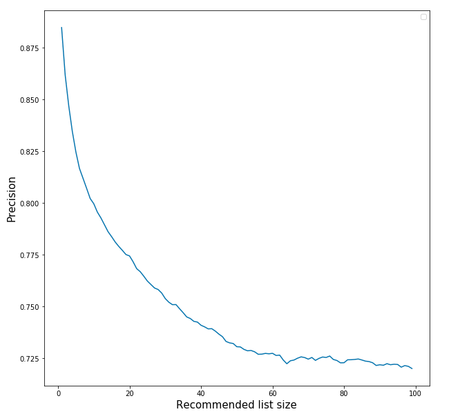
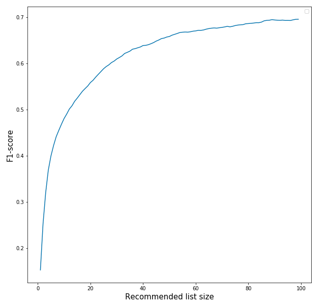

## Python code for user based collaborative filtering
This is Python implementation of simple user based collaborative filtering recommender system 


## Dependecies
The prominent packages are:

* numpy
* scikit-learn
* pandas 0.23.1

### Dataset
- [MovieLens 100K Dataset](https://grouplens.org/datasets/movielens/100k/)
- [MovieLens 1M Dataset](https://grouplens.org/datasets/movielens/1m/)
- [MovieLens 20M Dataset](https://grouplens.org/datasets/movielens/20m/)


### Run
```
mkdir datasets
cd scripts
./download_100.sh 
./download_1m.sh 
./download_20m.sh 
```

###  Running program:

```
python main.py --dataset ml-1m \
               --neighborhood_size 50 \
               --recommended_list_size 20 \
```

## RMSE, Precision, Recall and F1-score
---

 &nbsp; &nbsp;&nbsp;    
 &nbsp; &nbsp;&nbsp;    


## Useful Resources
---

- [Recommender Systems - The Textbook | Charu C. Aggarwal | Springer](https://www.springer.com/gb/book/9783319296579)
